# Inverse of StarGAN for Adverse Weather Image Reconstruction

A PyTorch implementation of Inverse StarGAN with Capsule Networks for reconstructing clear, normal-condition images from adverse weather conditions captured by autonomous vehicle cameras. The system is designed to enhance perception and safety for autonomous vehicles operating under challenging weather scenarios such as rain, snow, fog, and nightlight. This repository contains the code and training scripts to reproduce the results reported in our study.

## Overview

Autonomous vehicle perception suffers in adverse weather, making tasks like object detection, lane following, and obstacle avoidance unreliable. Traditional image-to-image translation models, including StarGAN, are limited to multi-style generation and may not generalize well across diverse weather conditions.

This project introduces:

Inverse StarGAN – Transforms images from multiple weather domains into a single clear visual domain, rather than multiple style outputs.

Capsule Neural Networks – Mitigates overfitting, captures spatial hierarchies, and improves sensitivity to object orientation.

Perceptual Loss – Preserves fine details in reconstructed images.

Adaptive Label Training – Initially trains with explicit weather labels, then with shuffled labels to enhance robustness to unknown weather severities.

## Key Features

Multi-weather reconstruction: Rain, snow, fog, nightlight → Normal conditions

Real-time inference suitable for autonomous driving pipelines

Trained on 100,000+ simulated images (AVIS ENGINE) with real-world validation (BDD100k)

High-quality results: Average PSNR = 22.21, SSIM = 0.92

Modular PyTorch implementation for experimentation and extension

## Dataset

Simulated data: Generated via AVIS ENGINE with weather-specific scenarios

Real-world validation: Subset of BDD100k dataset

Supports adverse weather image reconstruction and multi-domain generalization

Note: Training datasets are large; users can use subsets for experimentation or generate synthetic samples.

## Simulator

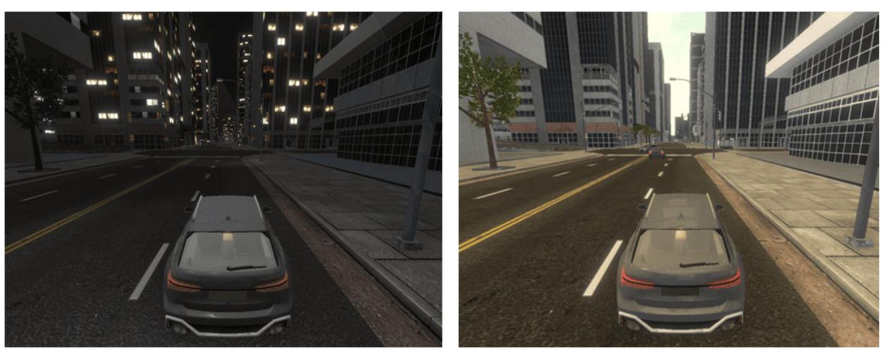
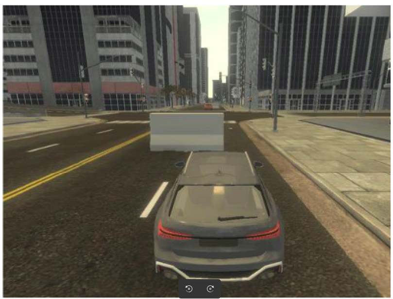
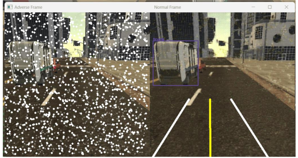
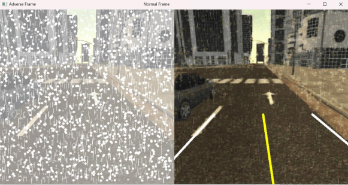
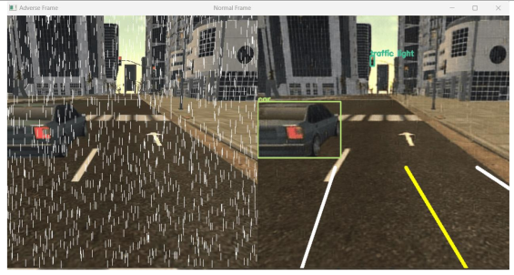

## Installation

```bash
# Clone the repository
git clone https://github.com/<your-username>/Inverse-StarGAN-Capsule.git
cd Inverse-StarGAN-Capsule


# Create a conda environment (optional)
conda create -n weather-gan python=3.9
conda activate weather-gan

# Install dependencies
pip install -r requirements.txt
```

## Usage

### Training
```bash
python train.py --dataset_path ./data --epochs 100 --batch_size 16 --lr 0.0002
```

### Inference
python inference.py --input ./test_images/rain.jpg --output ./results/clear.jpg --checkpoint ./weights/best_model.pth

## Results

Reconstructed images achieve PSNR ~22.21 and SSIM ~0.92 in closed-loop simulations.

Robust generalization across rain, snow, fog, nightlight.

Enhances safety and reliability of perception systems in autonomous vehicles.


## Control Diagrams

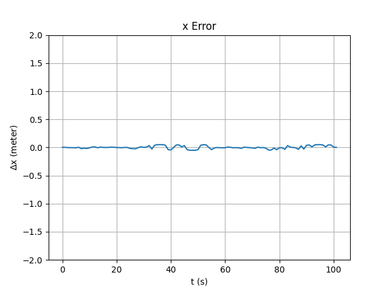
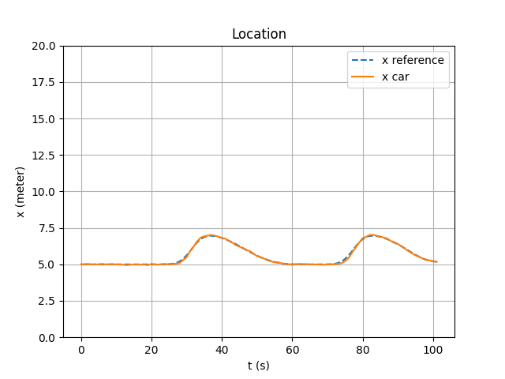
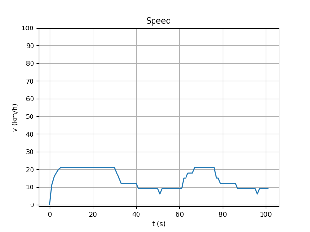
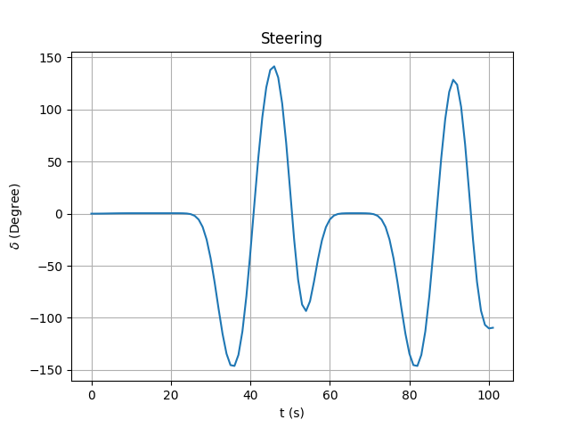
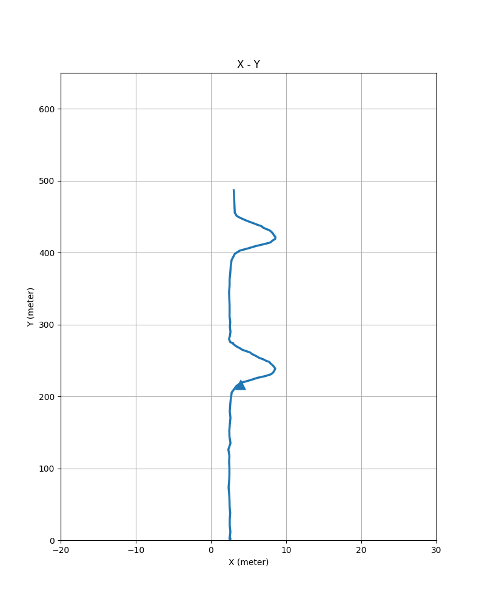
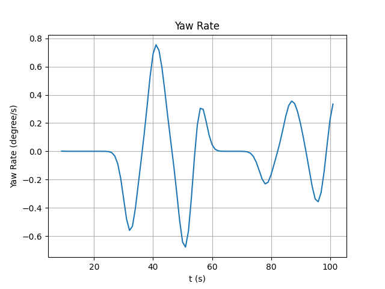

## References

```txt
@article{Samani2025InverseStarGAN,
  author    = {M. A. Samani and M. Farrokhi},
  title     = {Adverse to Normal Image Reconstruction Using Inverse of StarGAN for Autonomous Vehicle Control},
  journal   = {IEEE Access},
  volume    = {13},
  pages     = {77305--77316},
  year      = {2025},
  doi       = {10.1109/ACCESS.2025.3564848}
}
```
